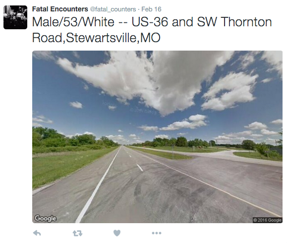

Tweeting the Locations of Police-related Civilian Deaths
====

This twitter bot parses a database of police-related civilian deaths and tweets the street view image of where the death took place. Original data from : [fatalencounters.org](http://www.fatalencounters.org/). I had to geocode the street locations in the original database and have included a modified version of it in this repo. 

Twitter bot: [fatal_counters](https://twitter.com/fatal_counters)

<br> 


<br> 
<br>  


Setup
---
To run the code, you have to add a config.js file with the following Twitter keys and tokens:

```
module.exports = {
  consumer_key:         ''
, consumer_secret:      ''
, access_token:         ''
, access_token_secret:  ''
}
```

and also a GoogleMapsAPI key for the street view image request.

